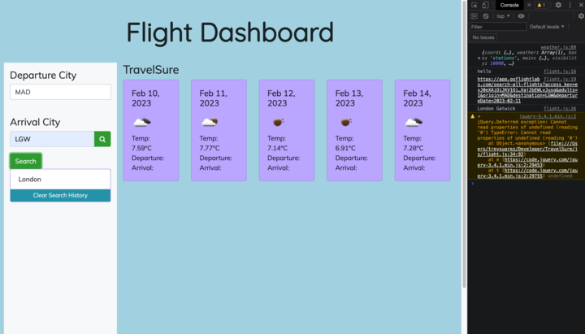

# TravelSure
Search engine for affordable destination packages.

# Description 
This travel API combines the functionality of OpenWeather API and GoFlightLabs to provide users with up-to-date weather information and flight search options for their travel plans. The API allows users to search for flights to their desired destination and view the weather forecast for their arrival city for the next 5 days.

# Usage
When using this API, users can input the name of the departure airport and arrival airport. The API will then retrieve flight options from GoFlightLabs and display them to the user. Additionally, the API will use the OpenWeather API to retrieve the weather forecast for the arrival city for the next 5 days.

Deploy using code: https://treywsuarez.github.io/TravelSure/

# Screenshots

# Features
- Search for flights based on departure airport, arrival airport, and travel dates
- Retrieve flight options from GoFlightLabs
- Retrieve 5-day weather forecast for arrival city from OpenWeather API
- Display weather information to the user
- Log the airports names 
